<h1 align="center">Evan Nixon Pratama</h1>

<p align="center">
  <b>Software Engineer</b> &bull; <b>Data Engineering & Automation</b> &bull; <b>Fullstack Web</b>
</p>

<p align="center">
  <a href="mailto:evannixonpratama1@gmail.com"></a>
  <a href="https://github.com/evannixon"></a>
  <a href="https://linkedin.com/in/evan-nixon-pratama/"></a>
  <a href="https://github.com/evannixon?tab=overview"></a>
</p>

---

### 🌐 Profile Overview

I build practical software solutions with an emphasis on **backend reliability**, **automated data harvesting**, and **clean user interfaces**. Focused on engineering automated pipelines and modern web platforms that streamline workflows and solve concrete problems.

```bash
evan@terminal:~$ neofetch --engineer
OS: Arch / Linux / Windows
Role: Software Developer & Automation Specialist
Stack: Python, PHP, JavaScript, SQL
Current Mission: Scaling data pipelines & reactive applications
Motto: With great code comes great responsibility 🕷️
```

- ⚙️ **Architecture & Backend**: Crafting clean APIs and database structures with PHP (Laravel) and Python.
- 🔄 **Data & Pipelines**: Automated scraping, data cleaning, and multi-format exports (Pandas, OpenPyXL, BeautifulSoup).
- 🎨 **Modern Frontend**: Building responsive, snappy client interfaces with JavaScript & TailwindCSS.

---

### 🧰 Technical Arsenal

<p align="center">
  <a href="https://skillicons.dev">
    
  </a>
</p>

<details>
<summary><b>📂 Detailed Tech & Tools Breakdown</b></summary>
<br>

| Domain | Technologies |
| :--- | :--- |
| **Languages** | Python 3, PHP 8+, JavaScript (ES6+), SQL |
| **Frameworks & Web** | Laravel, Node.js, Express, TailwindCSS, Bootstrap |
| **Data & Automation** | Pandas, BeautifulSoup4, Requests, OpenPyXL, GitHub Actions CI/CD |
| **Storage & Databases** | MySQL, PostgreSQL, SQLite, Redis |
| **Dev Tools & OS** | Git, GitHub, VS Code, Postman, Terminal / Bash, Windows |

</details>

---

### 🚀 Selected Work & Repositories

<table>
  <tr>
    <td width="50%" valign="top">
      <h3>🔄 <a href="https://github.com/evannixon/IntegrateData">IntegrateData</a></h3>
      <p>Automated university catalog extraction engine and multi-stage data processing pipeline. Handles raw web data ingestion, normalization, and structured exports into Excel, CSV, and JSON formats.</p>
      <p>
        <a href="https://github.com/evannixon/IntegrateData"></a>
        <a href="https://github.com/evannixon/IntegrateData"></a>
        <a href="https://github.com/evannixon/IntegrateData"></a>
      </p>
    </td>
    <td width="50%" valign="top">
      <h3>🔍 <a href="https://github.com/evannixon/lostfound">Lost & Found System</a></h3>
      <p>Fullstack web application designed for campus/community lost property management. Features user authentication, report lifecycles, and verification flows.</p>
      <p>
        <a href="https://github.com/evannixon/lostfound"></a>
        <a href="https://github.com/evannixon/lostfound"></a>
        <a href="https://github.com/evannixon/lostfound"></a>
      </p>
    </td>
  </tr>
  <tr>
    <td width="50%" valign="top">
      <h3>🌐 <a href="https://github.com/evannixon/nexa-landing">Nexa Landing</a></h3>
      <p>High-performance modern landing page featuring refined typography, smooth interactive UI components, and mobile-first responsive architecture.</p>
      <p>
        <a href="https://github.com/evannixon/nexa-landing"></a>
        <a href="https://github.com/evannixon/nexa-landing"></a>
        <a href="https://github.com/evannixon/nexa-landing"></a>
      </p>
    </td>
    <td width="50%" valign="top">
      <h3>🕷️ <a href="https://github.com/evannixon?tab=repositories">Web Automation & Scripting</a></h3>
      <p>Custom extraction scripts, workflow automations, and scheduled tasks tailored for continuous data processing and API integration.</p>
      <p>
        <a href="https://github.com/evannixon?tab=repositories"></a>
        <a href="https://github.com/evannixon?tab=repositories"></a>
        <a href="https://github.com/evannixon?tab=repositories"></a>
      </p>
    </td>
  </tr>
</table>

---

### 🕹️ Spider-Man: Rooftop Web Runner (Realistic 2D Engine)

<p align="center">
  <a href="https://evannixon.github.io/evannixon/" target="_blank" title="Klik untuk mainkan game di browser">
    
  </a>
</p>

<p align="center">
  <i>"Webs attach realistically to actual building ledges with physical pendulum momentum. Dive down to gain speed, swing up to slingshot over skyscrapers!"</i>
</p>

<p align="center">
  <a href="https://evannixon.github.io/evannixon/">
    
  </a>
</p>

<p align="center">
  <sub>🕹️ <b>Controls:</b> Hold <b>SPACE</b> or <b>Click</b> to anchor web to nearest building ledge &amp; swing. Release to slingshot forward!</sub>
</p>

<details>
<summary><b>🕷️ [Click for Terminal Mission Easter Egg]</b></summary>
<br>

```text
[MISSION BRIEFING]
Target: Infiltrate System & Extract Stolen Data Pipeline Keys
Threat: Low  |  Web-Fluid: 100%  |  Status: Crouched on Rooftop

[1] 🕸️ Shoot web-tether to the security camera?
    ↳ SUCCESS: Camera blinded with web fluid! Security alarm remains 0%.
[2] 💻 Connect decryptor into the ventilation terminal?
    ↳ BINGO: Data pipeline verified! 256-bit AES encryption bypassed.
[3] 🚀 Leap across the skyline back into the shadows?
    ↳ MISSION COMPLETE: Clean getaway into the quiet nocturnal city.
```

> *"Whatever comes our way, it's what we choose to build that defines who we are."*
</details>

---

### 🕷️ City Patrol & Contribution Grid

> *"Some days are hard, but someone has to keep the neighborhood running smoothly."*

<p align="center">
  <a href="https://github.com/evannixon?tab=overview&from=2026-09-10&to=2026-09-10" target="_blank" rel="noopener noreferrer" title="Klik untuk lihat kontribusi hari ini (10 Sep 2026)">
    
  </a>
  <br><br>
  <!-- Interactive Action Buttons -->
  <a href="https://github.com/evannixon?tab=overview&from=2026-09-10&to=2026-09-10" target="_blank" title="Buka kontribusi hari ini (10 Sep 2026)">
    
  </a>
  <a href="https://github.com/evannixon?tab=overview&from=2026-09-09&to=2026-09-09" target="_blank" title="Buka kontribusi kemarin (9 Sep 2026)">
    
  </a>
  <a href="https://github.com/evannixon?tab=overview&from=2026-09-09&to=2026-09-10" target="_blank" title="Lihat rentang streak aktif">
    
  </a>
  <a href="assets/spider_tracker.svg" target="_blank" title="Buka Radar SVG Langsung di Tab Baru (Semua 365 kotak bisa diklik per hari!)">
    
  </a>
  <br><br>
  <sub>📅 <b>Navigasi Cepat Aktivitas Bulanan:</b></sub><br>
  <sub>
    <a href="https://github.com/evannixon?tab=overview&from=2026-01-01&to=2026-01-31"><b>Jan</b></a> &bull;
    <a href="https://github.com/evannixon?tab=overview&from=2026-02-01&to=2026-02-28"><b>Feb</b></a> &bull;
    <a href="https://github.com/evannixon?tab=overview&from=2026-03-01&to=2026-03-31"><b>Mar</b></a> &bull;
    <a href="https://github.com/evannixon?tab=overview&from=2026-04-01&to=2026-04-30"><b>Apr</b></a> &bull;
    <a href="https://github.com/evannixon?tab=overview&from=2026-05-01&to=2026-05-31"><b>May</b></a> &bull;
    <a href="https://github.com/evannixon?tab=overview&from=2026-06-01&to=2026-06-30"><b>Jun</b></a> &bull;
    <a href="https://github.com/evannixon?tab=overview&from=2026-07-01&to=2026-07-31"><b>Jul</b></a> &bull;
    <a href="https://github.com/evannixon?tab=overview&from=2026-08-01&to=2026-08-31"><b>Aug</b></a> &bull;
    <a href="https://github.com/evannixon?tab=overview&from=2026-09-01&to=2026-09-10"><b>Sep (Aktif 🟢)</b></a>
  </sub>
</p>

<table align="center" width="100%">
  <tr>
    <td width="33%" align="center">
      <b>🛰️ Live API Tracking</b><br>
      <sub>Tersinkronisasi otomatis via GitHub Actions dari API kontribusi riil</sub>
    </td>
    <td width="33%" align="center">
      <b>⚡ Real-Time Streak</b><br>
      <sub>Aktivitas commit harian aktif hingga tanggal sekarang</sub>
    </td>
    <td width="33%" align="center">
      <b>🎯 Dynamic Spider Patrol</b><br>
      <sub>Spider-drone otomatis merayap mengikuti titik koordinat commit teraktif</sub>
    </td>
  </tr>
</table>

<p align="center">
  <a href="https://github.com/evannixon?tab=overview" target="_blank" title="Lihat Statistik Streak & Timeline Aktivitas GitHub Evan">
    
  </a>
</p>

<p align="center">
  <a href="https://github.com/evannixon?tab=followers" target="_blank" title="Lihat Followers GitHub Evan">
    
  </a>
  <a href="https://github.com/evannixon?tab=repositories" target="_blank" title="Jelajahi Repositori Publik Evan">
    
  </a>
  <a href="https://github.com/evannixon" target="_blank" title="Lihat Profil Utama GitHub">
    
  </a>
</p>

---

<p align="center">
  <sub>Crafted with chill vibes &amp; Spider-sense &bull; &copy; <b>Evan Nixon</b></sub>
</p>
